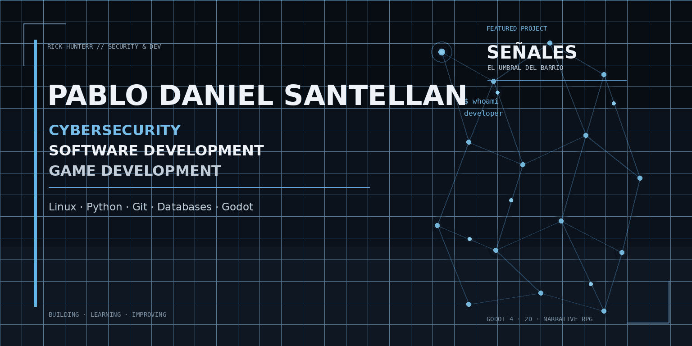

<div align="center">

</div>

<div align="center">

# Pablo Daniel Santellan
### Cybersecurity · Software Development · Game Development

Construyo proyectos para aprender, experimentar y convertir ideas en software funcional.

<br>

[](https://github.com/Rick-hunterr)
[](https://www.linux.org/)
[](https://www.python.org/)
[](https://git-scm.com/)
[](https://godotengine.org/)

</div>

---

## About

Soy desarrollador enfocado en **ciberseguridad, programación y desarrollo de videojuegos**.

Me gusta aprender mediante proyectos reales: construir una idea, investigar cómo funciona, resolver problemas, mejorar la arquitectura y documentar el proceso.

Actualmente estoy profundizando mis conocimientos en **ciberseguridad**, mientras continúo desarrollando proyectos de software y videojuegos.

---

## Current Focus

<div align="center">

| Área | Enfoque |
| :----------------------- | :--------------------------------------------------- |
| **Cybersecurity** | Linux · Systems · Networking · Security Fundamentals |
| **Software Development** | Python · Git · Architecture · Problem Solving |
| **Game Development** | Godot · GDScript · 2D · Pixel Art · Game Systems |
| **Web Development** | HTML · CSS · Frontend Projects |
| **Data** | Databases · Data Structures |

</div>

---

## Featured Project

<div align="center">

<a href="https://github.com/Rick-hunterr/signs">

</a>

## SEÑALES — El Umbral del Barrio

**Action-RPG narrativo 2D desarrollado con Godot y GDScript.**

Una historia sobre empatía, vínculos y las señales que dejamos en los demás.

El proyecto combina diseño narrativo, sistemas de juego, diálogo, exploración, documentación técnica y desarrollo de herramientas.

[**Explorar SEÑALES →**](https://github.com/Rick-hunterr/signs)

</div>

---

## Selected Projects

<div align="center">

<a href="https://github.com/Rick-hunterr/champaqui">

</a>

</div>

### Córdoba Capital → Cerro Champaquí, a pie
Cuaderno de ruta interactivo (Leaflet + HTML/CSS/JS) para una expedición de 7 personas caminando 165 km hasta la cumbre del Champaquí. Funciona 100% offline: rutas, datos y descargas GPX/KML sin depender de conexión.

[Ver repositorio →](https://github.com/Rick-hunterr/champaqui)

### CyberAlberdi
Proyecto orientado a **ciberseguridad y concientización digital**, combinando contenido educativo y desarrollo web.

[Ver repositorio →](https://github.com/Rick-hunterr/CyberAlberdi)

### Incognita
Videojuego educativo de matemáticas desarrollado como una experiencia interactiva.

[Ver repositorio →](https://github.com/Rick-hunterr/Incognita)

### Masterclass
Proyecto web desarrollado alrededor de contenido educativo y exploración de tecnologías web.

[Ver repositorio →](https://github.com/Rick-hunterr/Masterclass)

---

## Collaboration

### Benteveo Studio
Participé en el desarrollo del proyecto colaborativo **Benteveo Studio**, trabajando específicamente en el diseño, estructura y gestión de la **base de datos**.

[Ver proyecto →](https://github.com/axelzavaleta/benteveo-studio)

---

## Technologies

<div align="center">

</div>

<div align="center">

</div>

---
## GitHub Stats

<div align="center">


&nbsp;


<br><br>


</div>

---

## Currently Learning

```text
CYBERSECURITY
├── Linux & Systems
├── Networking
├── Security Fundamentals
└── Secure Development

SOFTWARE DEVELOPMENT
├── Software Architecture
├── Version Control
├── Project Organization
└── Development Practices
```

---

## Development Philosophy

> **Construir. Aprender. Mejorar.**

No busco solamente que un proyecto funcione.
Me interesa entender por qué funciona, detectar qué puede mejorar y convertir cada proyecto en una oportunidad para aprender algo nuevo.

---

## GitHub

<div align="center">

[](https://github.com/Rick-hunterr)

<br><br>

[Ver mis repositorios](https://github.com/Rick-hunterr?tab=repositories)
&nbsp;&nbsp;·&nbsp;&nbsp;
[Ver mis proyectos fijados](https://github.com/Rick-hunterr)

</div>

---

## Goals

```text
Cybersecurity
        ↓
Build stronger technical foundations

Software Development
        ↓
Create better structured and maintainable projects

Game Development
        ↓
Turn ideas into complete interactive experiences
```

---

<div align="center">

### Building · Learning · Improving

<br>

[GitHub](https://github.com/Rick-hunterr) · [SEÑALES](https://github.com/Rick-hunterr/signs)

</div>
